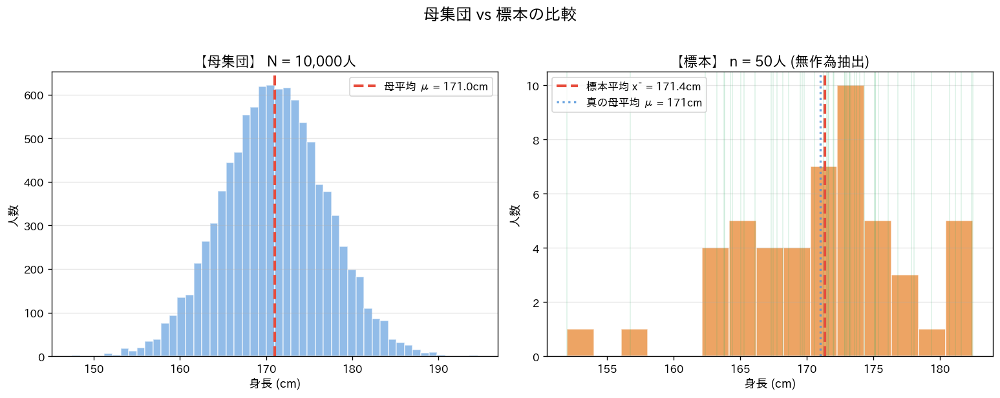
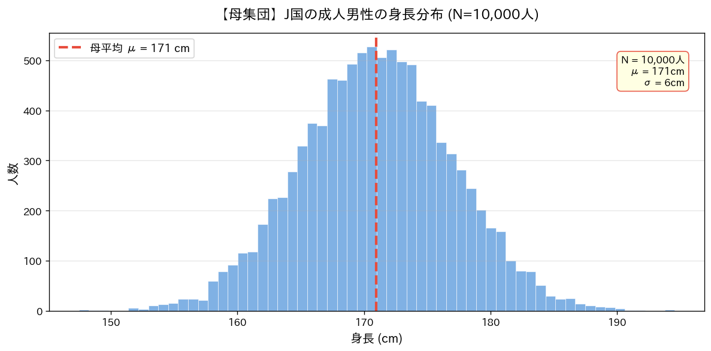
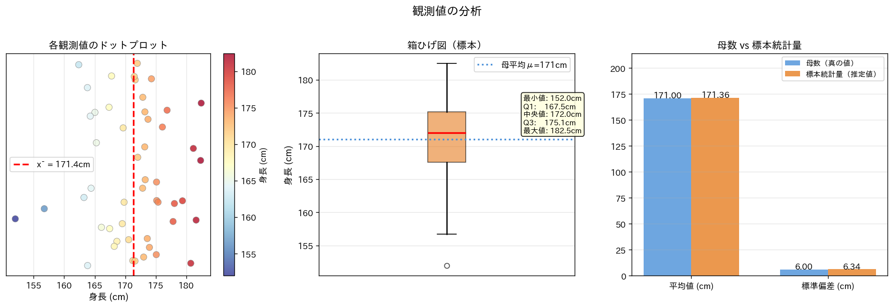
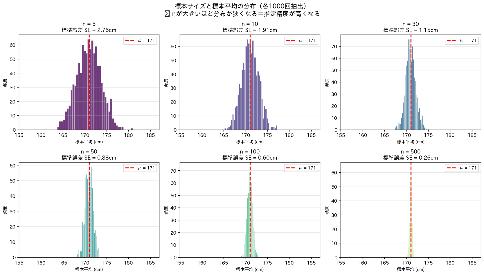
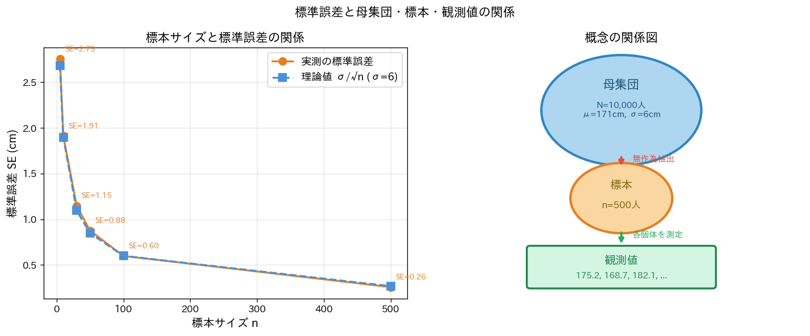

# 統計学の基礎：母集団・標本・観測値

統計学における3つの中心的な概念（母集団・標本・観測値）を、  
シミュレーションと可視化を通じて直感的に理解するためのノートブックです。  
Python版（Jupyter Notebook）とR版の2種類を用意しています。

---

## ファイル構成

| ファイル | 説明 |
|----------|------|
| `statistics_demo.ipynb` | Python版（numpy / matplotlib） |
| `statistics_demo_R.ipynb` | R版（ggplot2 / patchwork） |

---

## 概念の解説

### 1. 母集団 (Population)

**母集団**とは、調査・分析の対象となる**すべての個体の集合**です。

> 例：「J国の成人男性全員の身長」

母集団全体の特性を表す値を**母数（パラメータ）**と呼びます。

| 記号 | 名称 | 意味 |
|------|------|------|
| $N$ | 母集団サイズ | 母集団に含まれる個体の総数 |
| $\mu$ | 母平均 | 母集団全体の平均値 |
| $\sigma$ | 母標準偏差 | 母集団全体のばらつき |
| $\sigma^2$ | 母分散 | 母標準偏差の二乗 |

母平均と母標準偏差は以下の式で定義されます。

$$\mu = \frac{1}{N} \sum_{i=1}^{N} x_i$$

$$\sigma = \sqrt{\frac{1}{N} \sum_{i=1}^{N} (x_i - \mu)^2}$$

このノートブックでは、J国の成人男性の身長を $\mu = 171\text{ cm}$、$\mu = 171\text{ cm}$、$\sigma = 6$cm、$N = 10{,}000\text{ 人}$の正規分布として設定しています。

---

### 2. 標本 (Sample)

現実には母集団全員を調査することは費用・時間の面で困難です。  
そこで母集団から一部の個体を**無作為抽出（ランダムサンプリング）**します。  
この抽出された部分集合を**標本**と呼びます。

> 例：「J国の成人男性の中から無作為に選んだ50人」

標本から計算した値を**標本統計量**と呼び、母数の推定値として使います。

| 記号 | 名称 | 意味 |
|------|------|------|
| $n$ | 標本サイズ | 標本に含まれる個体の数 |
| $\bar{x}$ | 標本平均 | 標本の平均値（$\mu$ の推定値） |
| $s$ | 標本標準偏差 | 標本のばらつき（$\sigma$ の推定値） |

標本平均と標本標準偏差は次の式で求めます。

$$\bar{x} = \frac{1}{n} \sum_{i=1}^{n} x_i$$

$$s = \sqrt{\frac{1}{n-1} \sum_{i=1}^{n} (x_i - \bar{x})^2}$$

> **なぜ $n-1$ で割るのか？**  
> 標本から母分散を推定する際、$n$ で割ると過小推定になります。  
> $n-1$（自由度）で割ることで不偏推定量となり、  
> $E[s^2] = \sigma^2$ が成り立ちます。これを**不偏分散**と呼びます。

下図は母集団（左）と、そこから抽出した標本（右）の分布を比較したものです。  
標本平均 $\bar{x}$ が母平均 $\mu$ に近い値になっていることが確認できます。

---

### 3. 観測値 (Observation)

**観測値**とは、標本中の**各個体から実際に測定・記録した値**です。  
$i$ 番目の個体の観測値を $x_i$ と表します。

> 例：175.2 cm、168.7 cm、182.1 cm、…（各個人の身長の測定値）

観測値の集まりが標本であり、観測値から統計量を計算することで母数を推定します。

$$\text{観測値 } x_1, x_2, \ldots, x_n \xrightarrow{\text{集計}} \bar{x},\ s \xrightarrow{\text{推定}} \mu,\ \sigma$$

下図は観測値をドットプロット・箱ひげ図・棒グラフの3つの角度から可視化したものです。

---

### 4. 標準誤差 (Standard Error)

標本平均 $\bar{x}$ 自体もサンプリングのたびに異なる値をとります。  
この**標本平均のばらつき**を**標準誤差（SE）**と呼びます。

$$SE = \frac{\sigma}{\sqrt{n}}$$

標準誤差は標本サイズ $n$ の**平方根に反比例**します。  
つまり標本サイズを4倍にすると、標準誤差は半分になります。

$$n \times 4 \Rightarrow SE \times \frac{1}{2}$$

下図は6種類の標本サイズ（$n = 5, 10, 30, 50, 100, 500$）で各1,000回抽出を繰り返し、  
標本平均の分布を描いたものです。$n$ が大きいほど分布が母平均付近に集中します。

下図（左）では実測の標準誤差と理論値 $\sigma/\sqrt{n}$ が一致していることを確認できます。  
下図（右）の概念図は、母集団・標本・観測値の階層関係を示しています。

---

## ノートブックの構成

各ノートブックは以下の5ステップで構成されています。

### Step 1：母集団を作る
正規分布 $\mathcal{N}(\mu=171, \sigma^2=36)$ に従う $N=10{,}000\text{ 人}$の母集団を生成し、  
分布をヒストグラムで可視化します。

### Step 2：標本を抽出する
母集団から $n=50$ 人を無作為非復元抽出し、母集団と標本の分布を並べて比較します。

### Step 3：観測値を詳しく見る
ドットプロット・箱ひげ図・棒グラフを用いて観測値を多角的に分析します。

### Step 4：標本サイズの影響を理解する
$n = 5, 10, 30, 50, 100, 500$ の6段階で各1,000回抽出を繰り返し、  
大数の法則と標準誤差の理論値 $SE = \sigma / \sqrt{n}$ を視覚的に確認します。

### Step 5：インタラクティブ体験
`MY_SAMPLE_SIZE` と `MY_SEED` の2変数を変えるだけで、  
自分の標本を抽出して推定精度をその場で確認できます。

---

## 使い方

### Google Colab で開く

1. [Google Colab](https://colab.research.google.com) にアクセス
2. 「ファイル → ノートブックをアップロード」で `.ipynb` ファイルを開く

### R版を使う場合の注意

Colabにプリインストールされている `vctrs` のバージョンが古い場合があります。  
その場合は以下の手順で実行してください。

1. **セル1**（`vctrs` のアップデート）を実行
2. メニューの「**ランタイム → セッションを再起動**」を実行
3. **セル2以降**を順番に実行

また、ランタイムのタイプを **R** に変更する必要があります。  
「ランタイム → ランタイムのタイプを変更 → R」を選択してください。

---

## 主要な数式まとめ

| 名称 | 数式 | 備考 |
|------|------|------|
| 母平均 | $\mu = \dfrac{1}{N}\sum_{i=1}^{N} x_i$ | 母集団全体で計算 |
| 母分散 | $\sigma^2 = \dfrac{1}{N}\sum_{i=1}^{N}(x_i-\mu)^2$ | 母集団全体で計算 |
| 標本平均 | $\bar{x} = \dfrac{1}{n}\sum_{i=1}^{n} x_i$ | $\mu$ の推定量 |
| 不偏分散 | $s^2 = \dfrac{1}{n-1}\sum_{i=1}^{n}(x_i-\bar{x})^2$ | $\sigma^2$ の不偏推定量 |
| 標準誤差 | $SE = \dfrac{\sigma}{\sqrt{n}}$ | $\bar{x}$ のばらつき |
| 標準化 | $z = \dfrac{x - \mu}{\sigma}$ | 標準正規分布への変換 |

---

## 依存ライブラリ

### Python版
- `numpy` — 数値計算・乱数生成
- `matplotlib` — グラフ描画
- `pandas` — データフレーム操作
- `scipy` — 統計関数
- `japanize-matplotlib` — 日本語フォント対応

### R版
- `ggplot2` — グラフ描画
- `dplyr` — データ操作
- `tidyr` — データ整形
- `patchwork` — 複数プロットの結合
