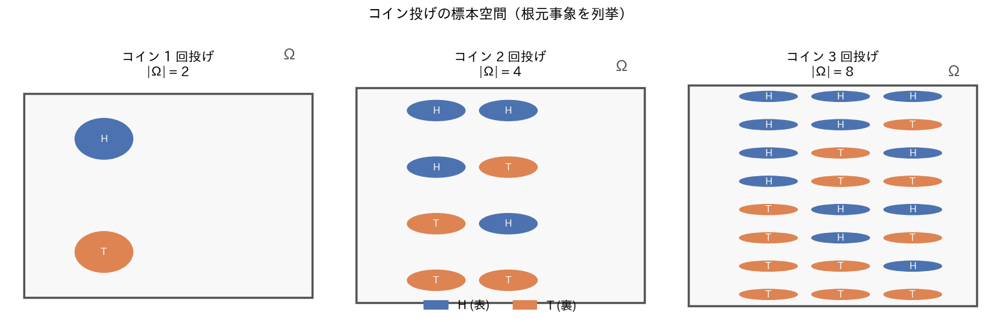
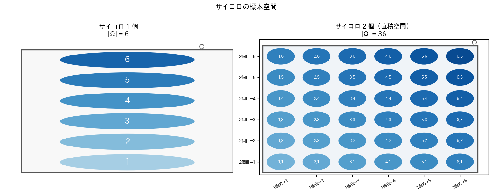
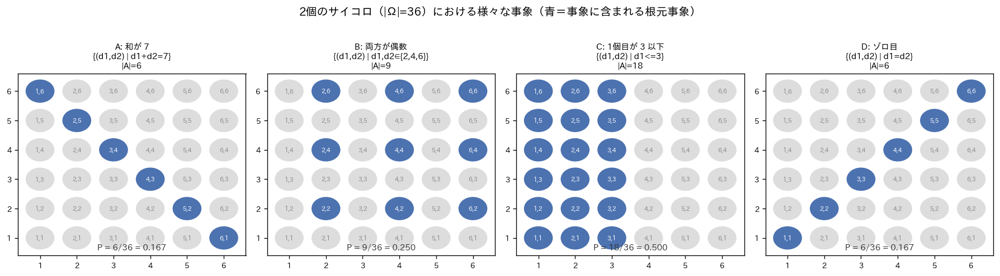
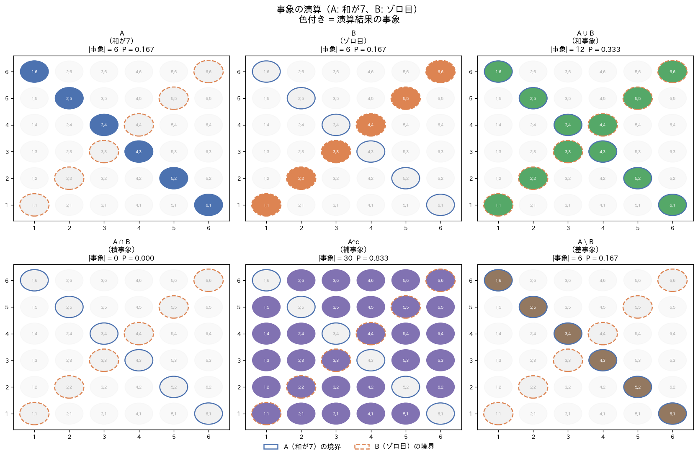
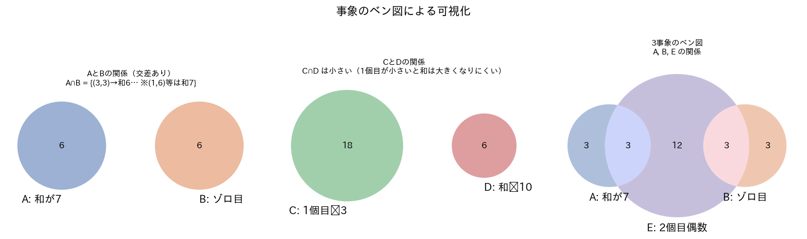
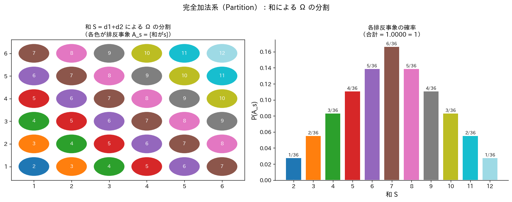
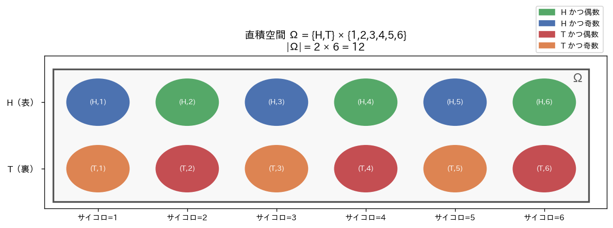
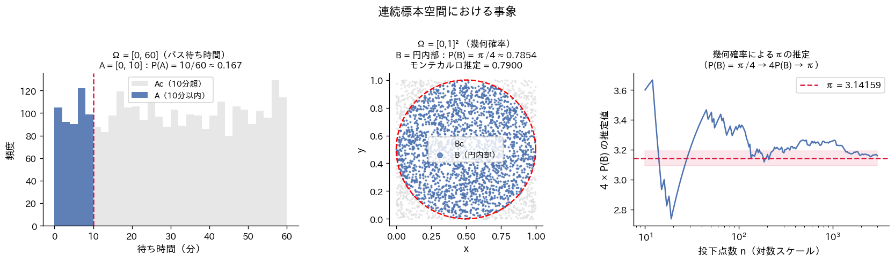

# 標本空間と事象

[](https://colab.research.google.com/)
[](https://colab.research.google.com/)
[](https://colab.research.google.com/)
[](LICENSE)

確率論の出発点となる**標本空間・事象・事象の演算**を、コイン・サイコロ・幾何確率の具体例とシミュレーションで体験的に学ぶ Jupyter Notebook です。Python 版・R 版の両方を用意しています。

---

## 目次

- [数理統計学的背景](#数理統計学的背景)
- [標本空間の構成](#標本空間の構成)
- [事象の定義と分類](#事象の定義と分類)
- [事象の演算](#事象の演算)
- [排反事象と完全加法系](#排反事象と完全加法系)
- [直積空間と多段試行](#直積空間と多段試行)
- [連続標本空間と幾何確率](#連続標本空間と幾何確率)
- [事象の独立性と排反性の違い](#事象の独立性と排反性の違い)
- [デモの構成](#デモの構成)
- [環境と実行方法](#環境と実行方法)
- [使用ライブラリ](#使用ライブラリ)
- [ファイル構成](#ファイル構成)
- [参考文献](#参考文献)

---

## 数理統計学的背景

### 確率論における「試行」と「結果」

確率論は、**不確実性を数学的に記述する**学問です。その出発点は「ある操作を行ったとき、何が起こりうるか」を厳密に定式化することにあります。この操作を**試行**（trial / experiment）と呼び、試行の結果として得られる個々の事柄を**結果**（outcome）と呼びます。

確率論を厳密に構築するためには、まず「何が起こりうるか」を漏れなく・重複なく列挙した集合が必要です。これが**標本空間**（sample space）  $\Omega$ です。標本空間を定義することは、確率論における最初の、そして最も重要なステップです。

### コルモゴロフの確率空間との接続

コルモゴロフ（1933年）は、確率論を測度論の枠組みで公理化しました。その三つ組 $(\Omega, \mathcal{F}, P)$ において：

- $\Omega$：**標本空間**（本ノートブックの主役）
- $\mathcal{F}$：**$\sigma$-加法族**（事象全体を構成する集合族）
- $P$：**確率測度**（各事象に数値を割り当てる関数）

本ノートブックは、この三つ組の第一成分 $\Omega$ と第二成分 $\mathcal{F}$ に焦点を当て、確率測度 $P$ を議論する前段として、標本空間と事象の構造を理解することを目的とします。

---

## 標本空間の構成

### コイン投げ（離散・有限標本空間）

最も単純な試行であるコイン投げでは、標本空間は有限集合となります。

$$\Omega_1 = \{H, T\}, \quad |\Omega_1| = 2$$

$n$ 回コイン投げを繰り返す場合、各回の結果は独立であり、標本空間は $n$ 個の集合の**直積**（Cartesian product）として表されます：

$$\Omega_n = \underbrace{\{H,T\} \times \{H,T\} \times \cdots \times \{H,T\}}_{n \text{ 個}} = \{H,T\}^n, \quad |\Omega_n| = 2^n$$

> 各根元事象は $\omega = (c_1, c_2, \ldots, c_n) \in \{H,T\}^n$ という $n$ 次元ベクトルで表されます。



*図1：コイン 1〜3 回投げの標本空間。各円が根元事象（青: H（表）、橙: T（裏））を表す。3回投げで、* $|\Omega| = 8 = 2^{3}$ *個の根元事象が列挙される。*

### サイコロ（直積空間）

1個のサイコロ投げでは $\Omega = \{1,2,3,4,5,6\}$、 $|\Omega|=6$ 。2個の場合は：

$$\Omega = \{1,2,3,4,5,6\}^2 = \{(d_1, d_2) \mid d_1, d_2 \in \{1,2,3,4,5,6\}\}, \quad |\Omega| = 36$$

2個のサイコロの根元事象 $(d_1, d_2)$ は、 $d_1$  を横軸、 $d_2$ を縦軸にとった  $6 \times 6$ のグリッドで視覚化できます。



*図2：サイコロ 1 個（$|\Omega|=6$）と 2 個（$|\Omega|=36$）の標本空間。2個の場合は直積空間として 36 個の根元事象が格子状に並ぶ。*

### べき集合と事象の数の爆発

標本空間 $\Omega$ に対して、その**べき集合**（power set）$2^\Omega$ は $\Omega$ のすべての部分集合の集合であり、確率を定義できる事象全体を表します。

$$|2^\Omega| = 2^{|\Omega|}$$

コインを $n$ 回投げる場合、$|\Omega| = 2^n$ であるため、事象の総数は：

$$|2^\Omega| = 2^{2^n}$$

| $n$（投げ回数） | $\|\Omega\| = 2^n$ | 事象数 $= 2^{\|\Omega\|}$ |
|:---:|:---:|:---:|
| 1 | 2 | 4 |
| 2 | 4 | 16 |
| 3 | 8 | 256 |
| 4 | 16 | 65,536 |
| 5 | 32 | 4,294,967,296 |

この**超指数的な増加**は、確率論において $\sigma$-加法族 $\mathcal{F}$ が $2^\Omega$（べき集合全体）ではなく、適切な部分族として定義される理由の一つです。

---

## 事象の定義と分類

**事象**（event）とは、標本空間 $\Omega$ の**部分集合** $A \subseteq \Omega$ のことです。「事象 $A$ が起こる」とは、試行の結果 $\omega$ が $A$ に属すること（$\omega \in A$）を意味します。

$$A \subseteq \Omega \iff A \text{ は事象}$$

### 事象の種類

| 事象の種類 | 定義 | 例（サイコロ2個）| 備考 |
|:----------|:-----|:----------------|:-----|
| **根元事象**（elementary event） | $\{\omega\}$（1要素） | $\{(3,4)\}$ | 最小単位 |
| **複合事象**（composite event） | $\|\cdot\| \geq 2$ の部分集合 | $\{(d_1,d_2) \mid d_1+d_2=7\}$ | 複数の根元事象の和 |
| **全事象**（certain event） | $\Omega$ | $\{1,2,3,4,5,6\}^2$ | 必ず起こる |
| **空事象**（impossible event） | $\emptyset$ | 「和が1」 | 決して起こらない |



*図3：2個のサイコロ（$|\Omega|=36$）における4種の事象。青色の点が各事象に属する根元事象を示す。「和が7」は6通り（$P=1/6$）、「両方偶数」は9通り（$P=1/4$）、「1個目が3以下」は18通り（$P=1/2$）、「ゾロ目」は6通り（$P=1/6$）。*

### 事象と確率の対応

古典的確率（equally likely outcomes）の場合、事象 $A$ の確率は：

$$P(A) = \frac{|A|}{|\Omega|}$$

ただし、これは根元事象が等確率のときのみ成立します。一般の確率測度では各根元事象に異なる重みが与えられます。

---

## 事象の演算

事象は集合であるため、集合演算をそのまま確率論の言語に翻訳できます。これが確率論を集合論・測度論の枠組みで記述する利点の一つです。

| 演算 | 集合記号 | 確率論的意味 | 定義 |
|:-----|:--------:|:------------|:-----|
| **和事象** | $A \cup B$ | $A$ または $B$ が起こる | $\{\omega \mid \omega \in A \text{ または } \omega \in B\}$ |
| **積事象** | $A \cap B$ | $A$ かつ $B$ が起こる | $\{\omega \mid \omega \in A \text{ かつ } \omega \in B\}$ |
| **補事象** | $A^c$ | $A$ が起こらない | $\{\omega \mid \omega \notin A\}$ |
| **差事象** | $A \setminus B$ | $A$ は起こるが $B$ は起こらない | $A \cap B^c$ |

### 包除原理（Inclusion-Exclusion Principle）

和事象の確率は、積事象の確率を用いて次のように表されます：

$$P(A \cup B) = P(A) + P(B) - P(A \cap B)$$

これは「$A$ と $B$ を単純に足すと $A \cap B$ が二重カウントされる」ことを補正したものです。$n$ 事象への一般化：

$$
P(A_{1} \cup \cdots \cup A_{n}) = \sum_{i} P(A_{i}) - \sum_{i < j} P(A_{i} \cap A_{j}) + \sum_{i < j < k} P(A_{i} \cap A_{j} \cap A_{k}) - \cdots
$$


> **統計的応用**：多重検定における**ボンフェローニ不等式**はこの包除原理の上界として導出されます。



*図4：事象 A（和が7）と B（ゾロ目）に対する6種の演算結果。$A \cap B = \emptyset$（和が7かつゾロ目 → 目の和は偶数のみになるが、7は奇数）であることが積事象の図から確認できる。包除原理の検証：$P(A \cup B) = 6/36 + 6/36 - 0/36 = 12/36 = 1/3$。*

### ベン図による直観的理解



*図5：左・中）2事象のベン図。A（和が7）とB（ゾロ目）は重なりなし（排反）。C（1個目$\leq$3）とD（和$\geq$10）は交差が小さい（1個目が小さいと和は大きくなりにくいため）。右）A・B・E（2個目偶数）の3事象ベン図。各領域の数値は根元事象の個数。*

---

## 排反事象と完全加法系

### 排反事象（Mutually Exclusive Events）

$$A \cap B = \emptyset \iff A \text{ と } B \text{ は排反}$$

排反のとき、確率の加法性が単純な形で成立します：

$$P(A \cup B) = P(A) + P(B)$$

これはコルモゴロフの公理3（加法性）の直接の適用です。

### 完全加法系（Partition / 分割）

$\Omega$ の**分割**（partition）とは、互いに排反かつ和が $\Omega$ になる事象の族 $\{A_1, A_2, \ldots, A_k\}$ です：

$$A_i \cap A_j = \emptyset \ (i \neq j), \qquad \bigcup_{i=1}^k A_i = \Omega$$

このとき、公理より：

$$\sum_{i=1}^k P(A_i) = P(\Omega) = 1$$

> **統計的応用**：全確率の法則（law of total probability）は分割を利用した基本定理であり、ベイズの定理の証明に不可欠です。

**例**：2個のサイコロの和 $S = d_1 + d_2 \in \{2, 3, \ldots, 12\}$ による分割

$$A_s = \{(d_1,d_2) \in \Omega \mid d_1 + d_2 = s\}, \quad s = 2, 3, \ldots, 12$$

これら11個の事象は互いに排反で $\Omega$ を分割します。



*図6：左）和 $S$ による $\Omega$ の分割。各色が排反事象 $A_s$ を表す。右）各排反事象の確率分布（三角形状）。確率の合計は $\sum_{s=2}^{12} P(A_s) = 1.0000$ となり、完全加法系の性質を確認できる。*

---

## 直積空間と多段試行

複数の独立した試行を組み合わせた標本空間を**直積空間**（product space）と呼びます：

$$\Omega = \Omega_1 \times \Omega_2, \quad |\Omega| = |\Omega_1| \times |\Omega_2|$$

直積空間の重要な性質は、各成分の試行が**独立**であるとき、事象の確率が積で表されることです：

$$A \subseteq \Omega_1, \quad B \subseteq \Omega_2 \text{ に対し } P(A \times B) = P_1(A) \cdot P_2(B)$$

**例**：コイン1回（$\Omega_1 = \{H, T\}$）× サイコロ1個（$\Omega_2 = \{1,\ldots,6\}$）

$$\Omega = \{H,T\} \times \{1,2,3,4,5,6\}, \quad |\Omega| = 2 \times 6 = 12$$

事象 $A = \{H\} \times \{1,\ldots,6\}$（表が出る）と $B = \{H,T\} \times \{2,4,6\}$（偶数の目）は独立：

$$P(A \cap B) = \frac{3}{12} = \frac{1}{4} = \frac{6}{12} \times \frac{6}{12} = P(A) \times P(B) \quad \checkmark$$



*図7：直積空間 $\Omega = \{H,T\} \times \{1,\ldots,6\}$（$|\Omega|=12$）。各根元事象を色分け（緑: H かつ偶数、青: H かつ奇数、赤: T かつ偶数、橙: T かつ奇数）して4つの排反グループに分割している。コインとサイコロが独立であることから $P(H \cap \text{偶数}) = 1/2 \times 1/2 = 1/4$ が確認できる。*

---

## 連続標本空間と幾何確率

標本空間は離散的である必要はありません。連続型の標本空間では、事象は区間・領域で表され、確率は長さ・面積・体積の比として定義されます（**幾何確率**）。

### 1次元連続標本空間

$$\Omega = [a, b], \quad P(A) = \frac{\text{length}(A)}{b - a}$$

**例**：バス待ち時間が $[0, 60]$ 分上の一様分布のとき、10分以内に来る確率：

$$P([0,10]) = \frac{10}{60} = \frac{1}{6} \approx 0.167$$

### 2次元連続標本空間（幾何確率）

$$\Omega = [0,1]^2, \quad P(A) = \text{area}(A)$$

**例（モンテカルロ法による $\pi$ の推定）**：

正方形 $[0,1]^2$ 内に原点 $(0.5, 0.5)$ を中心とする半径 $0.5$ の円を考えます。

$$B = \{(x,y) \mid (x-0.5)^2 + (y-0.5)^2 \leq 0.25\}$$

$$P(B) = \frac{\text{area}(B)}{\text{area}(\Omega)} = \frac{\pi \cdot 0.5^2}{1^2} = \frac{\pi}{4}$$

したがって $\pi = 4 \cdot P(B)$ となり、モンテカルロシミュレーションで $P(B)$ を推定することにより $\pi$ を計算できます。

$$\hat{\pi}_n = 4 \cdot \frac{1}{n}\sum_{i=1}^n \mathbf{1}_B((x_i, y_i)) \xrightarrow{n \to \infty} \pi \quad \text{（強大数の法則）}$$



*図8：左）1次元連続標本空間のバス待ち時間モデル。青色部分が事象 $A=[0,10]$、赤破線が境界。中）2次元連続標本空間における円内部の事象 $B$（青点）とモンテカルロ推定。右）点数 $n$ の増加に伴い $4\hat{P}(B) \to \pi$ へ収束する様子（大数の法則の確認）。*

---

## 事象の独立性と排反性の違い

初学者が混同しやすい二つの概念を明確に区別します。

### 定義の比較

| 性質 | 定義 | $P(A \cap B)$ | ベン図の特徴 |
|:-----|:-----|:-------------:|:------------|
| **排反**（Mutually Exclusive） | $A \cap B = \emptyset$ | $= 0$ | 重なりなし |
| **独立**（Independent） | $P(A \cap B) = P(A)P(B)$ | $= P(A)P(B) > 0$（一般に） | 重なりあり |

### 重要な定理

> **定理**：$P(A) > 0$ かつ $P(B) > 0$ のとき、排反と独立は同時に成立しない。

**証明**：$A \cap B = \emptyset$ を仮定すると $P(A \cap B) = 0$。独立であるためには $P(A)P(B) = 0$ が必要だが、$P(A) > 0, P(B) > 0$ より矛盾。$\blacksquare$

### 直観的理解

- **排反**は「一方が起きれば他方は絶対に起きない」という**論理的排除**の概念
- **独立**は「一方の発生が他方の確率に影響を与えない」という**情報的無関係**の概念

これら二つは全く異なる概念であり、混同は統計的推論の誤りにつながります。

---

## デモの構成

| セル | 内容 | 図 | 確認する数学的概念 |
|:----:|:-----|:--:|:-----------------|
| 2-1 | コイン投げ（1〜3回） | 図1 | 直積空間、$\|\Omega_n\| = 2^n$ |
| 2-2 | サイコロ（1個・2個） | 図2 | 直積空間、グリッド表現 |
| 2-3 | べき集合のサイズ爆発 | — | $\|2^\Omega\| = 2^{\|\Omega\|}$ の超指数的増加 |
| 3 | 事象の定義 | 図3 | 部分集合としての事象、古典的確率 |
| 4-1 | 事象の演算 | 図4 | 和・積・補・差事象、包除原理 |
| 4-2 | ベン図 | 図5 | 2〜3事象の関係の視覚化 |
| 4-3 | 排反と完全加法系 | 図6 | 分割、全確率の法則 |
| 5 | 直積空間 | 図7 | 独立な試行の組み合わせ |
| 6 | 連続標本空間 | 図8 | 幾何確率、モンテカルロ法 |
| 7 | 独立性 vs 排反性 | — | 二概念の違いの厳密な確認 |

---

## 環境と実行方法

### Google Colab での実行（推奨）

**Python 版**

1. [Google Colab](https://colab.research.google.com/) を開く
2. `sample_space_and_events_demo.ipynb` をアップロード
3. 「ランタイム」→「すべてのセルを実行」

**R 版**

1. [Google Colab](https://colab.research.google.com/) を開く
2. `sample_space_and_events_demo_R.ipynb` をアップロード
3. 「ランタイム」→「ランタイムのタイプを変更」→ **R** を選択
4. 「ランタイム」→「すべてのセルを実行」

> **注意**：R 版はセル 1 でパッケージのインストールと日本語フォント（Noto Sans JP）のダウンロードを行います。初回実行時はネットワーク環境によって数分かかる場合があります。

### ローカル環境での実行

**Python 版**

```bash
pip install numpy matplotlib matplotlib-venn japanize-matplotlib jupyter
jupyter notebook sample_space_and_events_demo.ipynb
```

**R 版**

```r
install.packages(c("IRkernel", "ggplot2", "dplyr", "tidyr",
                   "patchwork", "ggvenn", "scales", "showtext"))
IRkernel::installspec()
```

```bash
jupyter notebook sample_space_and_events_demo_R.ipynb
```

---

## 使用ライブラリ

### Python 版

| ライブラリ | バージョン | 用途 |
|:----------|:---------:|:-----|
| `numpy` | ≥ 1.24 | 乱数生成・配列演算 |
| `matplotlib` | ≥ 3.7 | グラフ描画 |
| `matplotlib-venn` | ≥ 0.11 | ベン図の描画 |
| `japanize-matplotlib` | ≥ 1.1 | 日本語フォント対応 |
| `itertools` | 標準ライブラリ | 直積空間の生成（`product`） |

### R 版

| パッケージ | バージョン | 用途 |
|:----------|:---------:|:-----|
| `ggplot2` | ≥ 3.4 | グラフ描画（Grammar of Graphics） |
| `dplyr` | ≥ 1.1 | データ操作 |
| `tidyr` | ≥ 1.3 | データ整形（`pivot_longer` 等） |
| `patchwork` | ≥ 1.1 | 複数グラフの配置 |
| `ggvenn` | ≥ 0.1 | ベン図の描画 |
| `scales` | ≥ 1.2 | 軸ラベルの書式設定 |
| `showtext` | ≥ 0.9 | 日本語フォント対応 |

---

## ファイル構成

```
.
├── README.md
├── sample_space_and_events_demo.ipynb      # Python版ノートブック
├── sample_space_and_events_demo_R.ipynb    # R版ノートブック
├── 0.png   # 図1：コイン投げの標本空間
├── 1.png   # 図2：サイコロの標本空間
├── 2.png   # 図3：事象の定義と部分集合
├── 3.png   # 図4：事象の演算（6種）
├── 4.png   # 図5：ベン図による可視化
├── 5.png   # 図6：完全加法系（和による分割）
├── 6.png   # 図7：直積空間（コイン × サイコロ）
└── 7.png   # 図8：連続標本空間と幾何確率
```

---

## 参考文献

- Kolmogorov, A. N. (1933). *Grundbegriffe der Wahrscheinlichkeitsrechnung*. Springer.（英訳: *Foundations of the Theory of Probability*, Chelsea, 1956）
- 伊藤清 (1991). 『確率論』. 岩波書店.
- Billingsley, P. (1995). *Probability and Measure* (3rd ed.). Wiley.
- Durrett, R. (2019). *Probability: Theory and Examples* (5th ed.). Cambridge University Press.
- 東京大学教養学部統計学教室 (1991). 『統計学入門』. 東京大学出版会.
- 竹村彰通 (2020). 『現代数理統計学』（新装改訂版）. 学術図書出版社.

---

## 関連ノートブック

| ノートブック | 内容 |
|:------------|:-----|
| `probability_axioms_demo.ipynb` | 確率の公理と性質（Python版） |
| `probability_axioms_demo_R.ipynb` | 確率の公理と性質（R版） |
| `sample_space_and_events_demo.ipynb` | 標本空間と事象（Python版）← 本資料 |
| `sample_space_and_events_demo_R.ipynb` | 標本空間と事象（R版）← 本資料 |

> **学習の流れ**：本ノートブック（標本空間と事象）で確率空間 $(\Omega, \mathcal{F})$ の構造を理解した後、`probability_axioms_demo` で確率測度 $P$ の公理を学ぶことで、確率論の基礎体系を体系的に習得できます。

---

## ライセンス

MIT License © 2024
